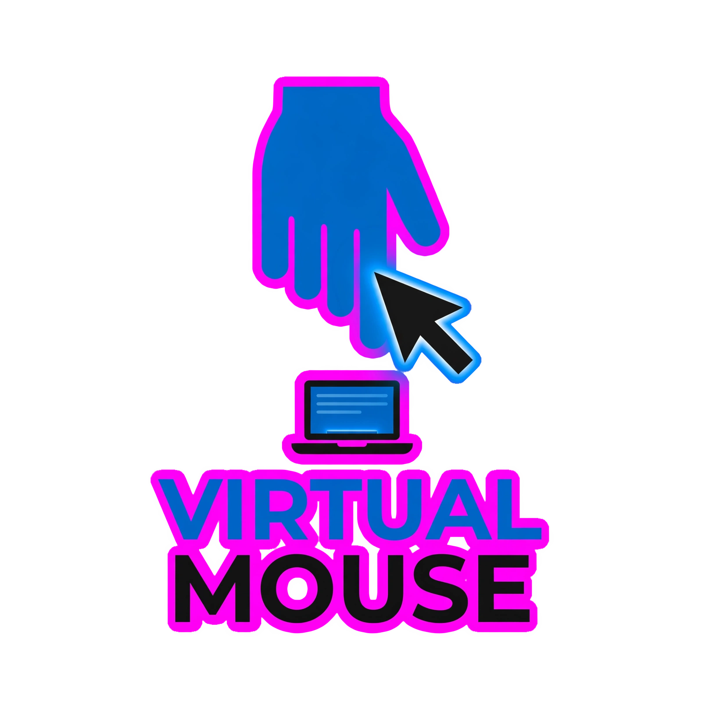

<div align="center">



# ✋ Vision-Based Virtual Mouse

**Control your computer with just your hand — no hardware needed.**

A real-time hand-tracking virtual mouse that turns your webcam into a touchless controller. Move the cursor, click, scroll, drag & drop — all with natural hand gestures powered by AI.

[](https://python.org)
[](LICENSE)
[](https://developers.google.com/mediapipe)
[](https://opencv.org)

</div>

---

## 📥 Download (Windows — No Python Required)

If you just want to **use** the virtual mouse without installing Python:

1. Go to the [**Releases**](https://github.com/sharjeelx03/vision-based-virtual-mouse/releases) page
2. Download `VirtualMouse.zip` from the latest release
3. Extract the ZIP file
4. Run `VirtualMouse.exe`

> **Note:** The `.exe` bundles everything — Python, OpenCV, MediaPipe — so it's a single portable folder. You still need a webcam and the `hand_landmarker.task` model file (included in the release ZIP).

---

## ✨ Features

- 🖱️ **7 Hand Gestures** — Move, left/right/double click, scroll, drag & drop, pause
- ⚡ **Real-Time Performance** — 30+ FPS on an Intel i7 CPU
- 🎯 **Anti-Jitter Smoothing** — Exponential Moving Average filter for stable cursor movement
- 📦 **Zero Hardware** — Works with any standard webcam
- 🎨 **Rich Visual HUD** — Live gesture labels, guide panel, pinch proximity bar, FPS counter
- ⌨️ **CLI Configurable** — Tune sensitivity, smoothing, scroll speed from the command line
- 🛡️ **Built-in Safety** — PyAutoGUI failsafe + pause gesture to instantly stop tracking

---

## 🎮 Gesture Guide

| Gesture | Hand Pose | Action |
|:---|:---|:---|
| ☝️ **Move** | Index finger up (others down) | Move the cursor |
| 👌 **Left Click** | Pinch thumb + index finger | Single left click |
| 🤏 **Right Click** | Pinch thumb + middle finger | Single right click |
| ✌️ **Double Click** | Pinch thumb + ring finger | Double left click |
| 🖖 **Scroll** | Index + middle fingers up | Scroll up/down by moving hand |
| ✊ **Drag & Drop** | Pinch & hold for 0.5s | Hold mouse button, release to drop |
| 🖐️ **Pause** | All five fingers open | Toggle tracking on/off |

---

## 🚀 Quick Start (Run from Source)

### Prerequisites

- **Python 3.10** or higher — [Download Python](https://www.python.org/downloads/)
- A **webcam** (built-in or USB)
- **Git** — [Download Git](https://git-scm.com/downloads)
- **Windows**, **macOS**, or **Linux**

### Step 1 — Clone the Repository

Open a terminal (Command Prompt, PowerShell, or Terminal) and run:

```bash
git clone https://github.com/sharjeelx03/vision-based-virtual-mouse.git
```

Then navigate into the project folder:

```bash
cd vision-based-virtual-mouse
```

### Step 2 — Create a Virtual Environment (Recommended)

<details>
<summary><b>Windows (PowerShell / CMD)</b></summary>

```powershell
python -m venv venv
venv\Scripts\activate
```

</details>

<details>
<summary><b>macOS / Linux</b></summary>

```bash
python3 -m venv venv
source venv/bin/activate
```

</details>

### Step 3 — Install Dependencies

```bash
pip install -r requirements.txt
```

### Step 4 — Download the Hand Tracking Model

The app needs a MediaPipe model file (~7.8 MB). Download it into the project folder:

**Windows (PowerShell):**
```powershell
Invoke-WebRequest -Uri "https://storage.googleapis.com/mediapipe-models/hand_landmarker/hand_landmarker/float16/latest/hand_landmarker.task" -OutFile "hand_landmarker.task"
```

**macOS / Linux:**
```bash
curl -L -o hand_landmarker.task "https://storage.googleapis.com/mediapipe-models/hand_landmarker/hand_landmarker/float16/latest/hand_landmarker.task"
```

### Step 5 — Run the Virtual Mouse

```bash
python virtual_mouse.py
```

Press **`q`** in the OpenCV window to quit. Press **`g`** to toggle the gesture guide overlay.

---

## ⚙️ Configuration

All settings can be tuned via command-line arguments:

```bash
python virtual_mouse.py --help
```

| Argument | Default | Description |
|:---|:---:|:---|
| `-c`, `--cam` | `0` | Camera device index |
| `--width` | `640` | Capture width (pixels) |
| `--height` | `480` | Capture height (pixels) |
| `-s`, `--smoothing` | `0.35` | EMA alpha (0.1 = very smooth, 1.0 = raw) |
| `--sensitivity` | `40` | Pinch distance threshold (lower = easier to click) |
| `--scroll-speed` | `15` | Scroll speed multiplier |
| `--no-guide` | — | Hide the gesture guide panel |
| `--no-mirror` | — | Disable webcam mirror flip |
| `--model` | `hand_landmarker.task` | Path to the MediaPipe model file |

### Examples

```bash
# Use external webcam with higher smoothing
python virtual_mouse.py --cam 1 --smoothing 0.5

# More sensitive clicks, faster scrolling
python virtual_mouse.py --sensitivity 45 --scroll-speed 25

# Clean view without guide panel
python virtual_mouse.py --no-guide
```

---

## 🏗️ Architecture

```
virtual_mouse.py
├── Config          — Dataclass with all tunable parameters
├── HandDetector    — MediaPipe Tasks wrapper (landmark detection + finger state)
├── GestureEngine   — Maps finger states → Gesture enum (priority-based)
├── HUD             — All visual overlays (labels, guide, indicators)
└── VirtualMouse    — Main loop (capture → detect → act → draw)
```

### How It Works

1. **Capture** — OpenCV reads a 640×480 frame from the webcam
2. **Detect** — MediaPipe's HandLandmarker identifies 21 hand landmarks
3. **Classify** — GestureEngine determines which gesture is being performed
4. **Map** — Index finger coordinates are mapped from a "reduction box" to full screen resolution using `numpy.interp`
5. **Smooth** — An EMA filter removes jitter from the coordinates
6. **Act** — PyAutoGUI executes the corresponding OS action (move, click, scroll, drag)
7. **Draw** — The HUD renders gesture labels, indicators, and overlays

### Anti-Jitter (EMA Smoothing)

Raw hand tracking coordinates jitter ±3-5px per frame. The Exponential Moving Average filter smooths this:

```
smoothed_t = α × raw_t + (1 − α) × smoothed_{t−1}
```

- `α = 1.0` → No smoothing (raw input)
- `α = 0.35` → Balanced (default)
- `α = 0.1` → Very smooth but sluggish

---

## 🔨 Building the Windows EXE

Want to build the `.exe` yourself? Here's how:

### Prerequisites

- All the [Quick Start](#-quick-start-run-from-source) setup steps completed
- PyInstaller installed:

```bash
pip install pyinstaller
```

### Build

Run the included build script:

```powershell
python build_exe.py
```

Or build manually with PyInstaller:

```powershell
pyinstaller --name VirtualMouse --onedir --noconsole --icon=NONE --add-data "hand_landmarker.task;." virtual_mouse.py
```

The built executable will be in the `dist/VirtualMouse/` folder.

> **Tip:** The `--onedir` mode creates a folder with the `.exe` + dependencies. This is faster to build and launch than `--onefile`.

---

## 🔧 Troubleshooting

<details>
<summary><b>❌ "Model file not found" error</b></summary>

Download the model file — see [Step 4](#step-4--download-the-hand-tracking-model) in Quick Start.
</details>

<details>
<summary><b>❌ "Cannot open webcam" error</b></summary>

- Make sure no other app is using the webcam
- Try a different camera index: `python virtual_mouse.py --cam 1`
- Check that your webcam drivers are installed
</details>

<details>
<summary><b>❌ Cursor jumps to screen corner / failsafe triggers</b></summary>

This happens when your hand reaches the edge of the camera's view. Keep your hand inside the blue "reduction box" shown in the video feed.
</details>

<details>
<summary><b>❌ Cursor is too jittery</b></summary>

Lower the smoothing alpha for more aggressive filtering:
```bash
python virtual_mouse.py --smoothing 0.2
```
</details>

<details>
<summary><b>❌ Clicks are too sensitive / not registering</b></summary>

Adjust the pinch threshold:
```bash
# Easier to click (fingers don't need to be as close)
python virtual_mouse.py --sensitivity 50

# Harder to click (must pinch tighter)
python virtual_mouse.py --sensitivity 30
```
</details>

<details>
<summary><b>❌ Low FPS</b></summary>

- Close other CPU-intensive applications
- Try a lower resolution: `python virtual_mouse.py --width 320 --height 240`
- Ensure you're not running in a virtual machine
</details>

<details>
<summary><b>❌ EXE build fails</b></summary>

- Make sure you're in the activated virtual environment
- Run `pip install pyinstaller` again
- Check that `hand_landmarker.task` exists in the project folder
- Try: `pip install --upgrade pyinstaller`
</details>

---

## 📁 Project Structure

```
vision-based-virtual-mouse/
├── virtual_mouse.py         # Main application (all-in-one)
├── build_exe.py             # Build script for Windows EXE
├── requirements.txt         # Python dependencies
├── hand_landmarker.task     # MediaPipe hand model (downloaded separately)
├── LICENSE                  # MIT License
├── .gitignore               # Git ignore rules
└── README.md                # This file
```

---

## 🤝 Contributing

Contributions are welcome! Here's how:

1. **Fork** the repository
2. **Create** a feature branch: `git checkout -b feature/amazing-feature`
3. **Commit** your changes: `git commit -m "Add amazing feature"`
4. **Push** to the branch: `git push origin feature/amazing-feature`
5. **Open** a Pull Request

### Ideas for Contributions

- 🎵 Add sound feedback for gestures
- 📐 Configurable gesture mappings (YAML/JSON config file)
- 🖥️ Multi-monitor support
- 📸 Screenshot gesture
- 🎨 Custom colour themes
- 📊 Gesture accuracy metrics / logging

---

## 📄 License

This project is licensed under the **MIT License** — see the [LICENSE](LICENSE) file for details.

---

## 🙏 Acknowledgments

- [**MediaPipe**](https://developers.google.com/mediapipe) by Google — hand landmark detection
- [**OpenCV**](https://opencv.org) — video capture and image processing
- [**PyAutoGUI**](https://pyautogui.readthedocs.io) — cross-platform mouse/keyboard control
- [**NumPy**](https://numpy.org) — numerical computing

---

<div align="center">

**⭐ If you found this useful, please give it a star!**

Made with ❤️ by [Sharjeel](https://github.com/sharjeelx03)

</div>
